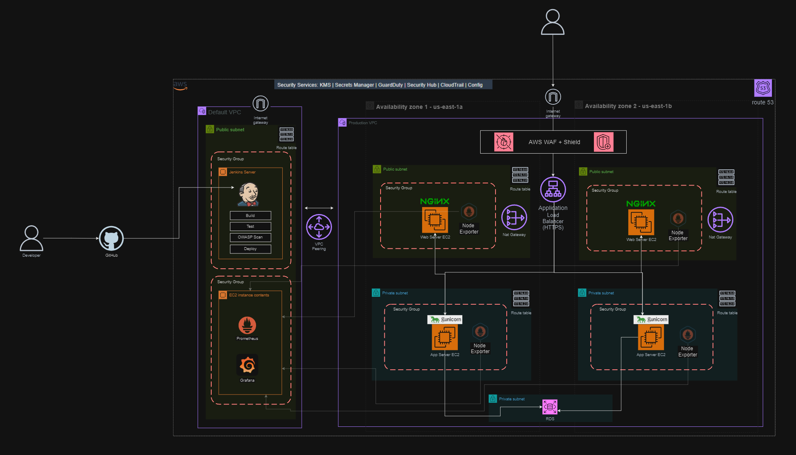

# Microblog Infrastructure Security Audit Report

## Executive Summary

#### Security Auditors: Shafee Ahmed, Uzo Bolarinwa, Clint Kanyali

As requested, our team assessed Microblog's infrastructure following reports of suspicious system behavior and unusual user activity. Our comprehensive security audit revealed several critical vulnerabilities that require immediate attention to prevent potential data breaches and ensure the platform's security as the company continues its rapid growth.

### Security Assessment Overview
Our review identified multiple security concerns that require immediate attention. The assessment focused on:
- Network security architecture and configurations
- Access control mechanisms and policies
- Data handling practices and encryption
- Application security and deployment practices
- Monitoring and incident response capabilities

### Current State Assessment
Our analysis of the current infrastructure revealed several security gaps and areas for improvement. The following diagram illustrates the existing deployment:


### Project Implementation Steps

1. **Initial Infrastructure Assessment**
   - Reviewed existing AWS architecture and configurations
   - Analyzed current security group settings and network access rules
   - Evaluated application deployment practices
   
2. **Vulnerability Analysis**
   - Performed detailed analysis of security logs
   - Identified critical security gaps in current deployment
   - Identified suspicious activity patterns

3. **Security Improvements Implementation**
   - Developed hardened security group configurations
   - Implemented HTTPS with proper SSL/TLS
   - Configured WAF rules and protection
   - Established a secure CI/CD pipeline

4. **Testing and Validation**
   - Validated security group changes
   - Tested application security improvements
   - Implemented monitoring and logging functionality

### Critical Assets Requiring Protection
- **Infrastructure Components**
  - EC2 instances and compute resources
  - Network infrastructure (VPC, subnets, routing)
  - Security groups and access controls
- **User Data Components**
  - User credentials and authentication data
  - Personal information and user-generated content
  - Database systems
- **Application Components**
  - Application code and configurations
  - Session management systems

### Key Findings
Critical vulnerabilities were identified in three main areas:
1. **Infrastructure Vulnerabilities**
   - Overly permissive security group configurations
   - Unrestricted access to critical ports
   - Lack of network segmentation
2. **Application Security Vulnerabilities**
   - Production environment running on an insecure development server
   - Missing HTTPS implementation
   - Inadequate session management
3. **User Data Security**
   - SQL injection vulnerabilities in user authentication
   - Insufficient data encryption
   - Inadequate access controls

### Security Event Analysis
Current security monitoring has detected numerous suspicious events:


### Primary Recommendations
- Immediate migration to production-grade server infrastructure
- Implementation of strict security group policies
- Remediation of SQL injection vulnerabilities
- Deployment of AWS security services suite (KMS, GuardDuty, Security Hub, etc.)

---

## Vulnerability Assessment & Remediation

### Three Critical Vulnerabilities Addressed

#### 1. Development Server in Production Environment
- **Severity**: Critical
- **Issue**: The application currently runs on Flask's development server in production
- **Evidence**: 
  ```log
  INFO:werkzeug:WARNING: This is a development server. Do not use it in a production deployment.
  WARNING:werkzeug: * Debugger is active!
  INFO:werkzeug: * Debugger PIN: 109-208-768
  ```
- **Evidence 2**:
  ```
  INFO:werkzeug: * Running on all addresses (0.0.0.0)
   * Running on http://127.0.0.1:5000
   * Running on http://172.31.4.239:5000
   INFO:werkzeug: Press CTRL+C to quit
   INFO:werkzeug: * Restarting with stat
   WARNING:werkzeug: * Debugger is active!
   INFO:werkzeug: * Debugger PIN: 112-130-713
   INFO:werkzeug:75.47.217.196 - - [04/Nov/2024 01:38:51] "GET /auth/login?next=/ HTTP/1.1" 302 -
   INFO:werkzeug:75.47.217.196 - - [04/Nov/2024 01:38:51] "GET /auth/login?next=/ HTTP/1.1" 200 -
   INFO:werkzeug:75.47.217.196 - - [04/Nov/2024 01:38:52] "GET /favicon.ico HTTP/1.1" 404 -
   INFO:root:Login attempt - Username: Uzo, Password: uzostrongpassword
   INFO:werkzeug:75.47.217.196 - - [04/Nov/2024 01:39:44] "POST /auth/login?next=/ HTTP/1.1" 302 -
   INFO:werkzeug:75.47.217.196 - - [04/Nov/2024 01:39:44] "GET /auth/login HTTP/1.1" 200 -
   INFO:werkzeug:75.47.217.196 - - [04/Nov/2024 01:40:57] "POST /auth/login HTTP/1.1" 302 -
   INFO:werkzeug:75.47.217.196 - - [04/Nov/2024 01:40:57] "GET /auth/login HTTP/1.1" 200 -

- **Key Issues**:
  - Not designed for production loads
  - Lacks security hardening
  - Debug mode exposed (remote code execution risk)
  - No worker management or graceful restarts
- **Solution**: Replace with Gunicorn and systemd:
  ```bash
  # Production-Grade Fix
  sudo tee /etc/systemd/system/microblog.service << EOF
  [Unit]
  Description=Microblog Gunicorn Service
  After=network.target

  [Service]
  User=ubuntu
  WorkingDirectory=/home/ubuntu/microblog
  Environment="PATH=/home/ubuntu/microblog/venv/bin"
  ExecStart=/home/ubuntu/microblog/venv/bin/gunicorn -w 4 -b 0.0.0.0:5000 microblog:app
  Restart=always

  [Install]
  WantedBy=multi-user.target
  EOF
  ```

- **Updated script to not log passwords:
  
  
   

#### 2. Overly Permissive Security Groups
- **Severity**: Critical
- **Issues Identified**:
  - Unrestricted SSH access (Port 22) open to all IP addresses
  - Exposed application ports (80, 5000) without restrictions
  - No HTTPS encryption (443)
  - Overly permissive egress rules allowing potential data exfiltration
- **Evidence**: Current security group configuration:
  ```hcl
  # Current Vulnerable Configuration
  ingress {
      from_port   = 22
      to_port     = 22
      protocol    = "tcp"
      cidr_blocks = ["0.0.0.0/0"]
  }
  ```
- **Solution**: 
  - Implement network segmentation with public/private subnets
  - Restrict security group rules to specific CIDRs
  - Configure HTTPS with proper SSL/TLS termination
  - Implement strict egress rules based on least privilege:
  ```hcl
  # Security-Hardened Configuration
  ingress {
      from_port   = 22
      to_port     = 22
      protocol    = "tcp"
      cidr_blocks = ["your_trusted_ip_range/32"]
  }

  ingress {
      from_port   = 443
      to_port     = 443
      protocol    = "tcp"
      cidr_blocks = ["0.0.0.0/0"]
  }
  ```

#### 3. SQL Injection Vulnerabilities
- **Severity**: Critical
- **Issue**: Unsanitized user input in database queries
- **Attack Patterns Detected**:
  - Boolean-based injection attempts
  - UNION-based injection attacks
  - Destructive queries
  - Authentication bypass attempts
- **Security Implications**:
  - Unauthorized data access and manipulation
  - Potential database destruction
  - Authentication bypass and privilege escalation
- **Evidence**: Detected attack attempts:
  ```log
  Login attempt - Username: ' OR '1'='1, Password: ****
  Login attempt - Username: admin'; DROP TABLE users; --, Password: ****
  ```
- **Solution**: Remove password logging. Prevent password enumeration:
  ```python
  # CloudSec-TF update: removed password logging
          logging.info(f"Login attempt - Username: {username}")
          
          user = User.query.filter_by(username=username).first()

          # CloudSec-TF update: prevent username enumeration
          if user is None or not user.check_password(form.password.data):
              flash(_('Invalid username or password'))
              return redirect(url_for('auth.login'))
  ```

### Implementation Details
Here are the specific steps taken to address each vulnerability:

1. **Development Server Fix**
   * Implemented Gunicorn
   * Configured systemd service
   * Validated production deployment

2. **Security Groups Hardening**
   * Implemented strict ingress rules
   * Configured HTTPS
   * Validated access controls

3. **SQL Injection Prevention**
   * Implemented input sanitization
   * Removed sensitive logging
   * Added prepared statements

### Additional Security Findings

1. No HTTPS in production exposes all traffic in plaintext
2. Passwords stored without proper hashing could lead to credential exposure
3. Missing rate limiting allows unlimited login attempts
4. No logging of successful logins makes audit trails incomplete
5. Unpatched dependencies could contain known vulnerabilities
6. Missing WAF leaves application exposed to common web attacks
7. No backup strategy risks permanent data loss
8. Plain text configuration files may expose sensitive credentials
9. Missing monitoring prevents early detection of security incidents
10. Lack of session timeouts allows indefinite access after login

---

# Secure Deployment Design
The infrastructure diagram below illustrates our recommended secure architecture that addresses the current vulnerabilities in the Microblog application:



## This new architecture incorporates:

By implementing a multi-AZ setup with proper VPC segmentation, WAF protection, and dedicated security groups across public and private subnets, it offers significant improvements over the current single-instance deployment. The addition of AWS Shield and WAF would prevent SQL injection attempts, while the separation of components into private subnets with controlled access through NGINX reverse proxies would eliminate the current security group exposure.

This architecture also incorporates proper CI/CD pipelines through Jenkins, replacing the direct Flask development server deployment with a production-grade setup, and introduces monitoring through Node Exporter - addressing all three major vulnerabilities while providing a scalable, secure foundation for future growth.

*In a nutshell:*
- Multi-AZ setup with proper VPC segmentation
- NGINX reverse proxies
- CI/CD pipelines through Jenkins
- Dedicated security groups across public and private subnets
- Monitoring through Node Exporter
- AWS Security Services Intergration
- AWS WAF + Shield for DDoS protection and web filtering
    Additional AWS Security Services Recommendations:
    - KMS for encryption
    - Secrets Manager for credentials
    - GuardDuty for threat detection
    - Security Hub for security posture management
    - CloudTrail for audit logging
    - Config for compliance

---

## Compliance & Future Considerations

### Regulatory Compliance
- Use frameworks such as the NIST to adhere to CIA triad
- Implements controls for PCI DSS compliance
- Addresses GDPR requirements for data protection
- Align with SOC 2 security principles

### Success Metrics
- Zero critical security incidents
- 99.9% uptime
- Compliance with all relevant standards
- Reduced mean time to detect (MTTD) and respond (MTTR)

## Conclusion
The identified vulnerabilities pose significant risks to Microblog's infrastructure and user data. By implementing the recommended fixes for the three critical vulnerabilities and following the proposed timeline for additional security measures, Microblog can significantly improve its security posture and protect against potential threats as it continues to scale.

---

### Team Members
- **[Kevin Gonzalez](https://github.com/kevingonzalez7997)**
- **[Shafee Ahmed](https://github.com/shafeeshafee)**
- **[Clinton Kanyali](https://github.com/clintkan)**
- **[Uzo Bolarinwa](https://github.com/uzobola)**

---
